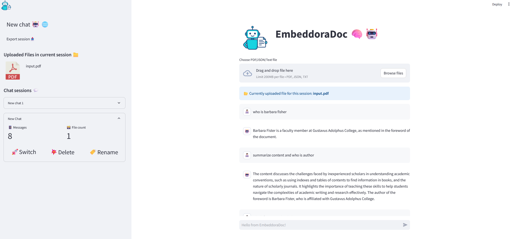

<p align="center">
  
</p>

<h1 align="center">EmbeddoraDoc 🧠🤖</h1>

<p align="center">
  <b>Hybrid Retrieval-Augmented Document Intelligence Assistant</b>
</p>

<p align="center">
  
  
  
  
  
</p>

<p align="center">
  <a href="https://github.com/Maharavan/EmbeddoraDoc/stargazers">
    
  </a>
  <a href="https://github.com/Maharavan/EmbeddoraDoc/forks">
    
  </a>
</p>

---

## 🚀 Overview

**EmbeddoraDoc** is a **session-aware Retrieval-Augmented Generation (RAG) assistant** that allows users to upload documents (**PDF / TXT / JSON**) and interact with them conversationally.

Unlike basic vector-only RAG systems, EmbeddoraDoc uses a **hybrid retrieval pipeline** combining semantic embeddings, keyword search, and cross-encoder reranking to deliver **accurate, grounded answers with reduced hallucinations**.

---

## 🧠 Why EmbeddoraDoc?

Traditional RAG systems often:

* Miss exact keywords (IDs, logs, error codes)
* Retrieve loosely related chunks
* Hallucinate when context is weak

**EmbeddoraDoc solves this by design.**

### 🔬 Hybrid Retrieval Pipeline

```
FAISS (Semantic Recall)
      +
BM25 (Keyword Precision)
      ↓
Cross-Encoder Reranking
      ↓
Hallucination-Guarded Answering
```

---

## ✨ Features

| Feature                | Description                          |
| ---------------------- | ------------------------------------ |
| 📂 Session Isolation   | Independent document index per chat  |
| 🔍 Hybrid Retrieval    | FAISS + BM25                         |
| 🧠 Reranking           | `ms-marco-MiniLM-L-6-v2`             |
| 🛡 Hallucination Guard | Context-validated answers            |
| 🗂 File Support        | PDF, TXT, JSON                       |
| 💾 Local Cache         | Persistent FAISS + BM25              |
| 💬 Chat Sessions       | Switch chats without losing progress |
| 🧩 Modular Codebase    | Easy to extend                       |

---

## 🏗 Architecture

```
User
 ↓
Streamlit UI
 ↓
Loader & Chunker
 ↓
Hybrid Retrieval Engine
  ├─ FAISS
  ├─ BM25
  └─ Cross-Encoder
 ↓
LLM (Answer + Validation)
```

---

## 📁 Project Structure

```
EmbeddoraDoc/
│── app/
│   ├── main.py
│   ├── components/
│   └── utility/
│── loader/
│── vector_store/
│── embeddings/
│── assets/
│   ├── logo.png
│   └── screenshots/
│── data/
│── LICENSE
│── README.md
│── requirements.txt
```

---

## ⚙️ Installation & Run (Local)

### 1️⃣ Create Virtual Environment

```bash
python -m venv .venv
source .venv/bin/activate     # Linux / Mac
.venv\Scripts\activate        # Windows
```

### 2️⃣ Install Dependencies

```bash
pip install -r requirements.txt
```

### 3️⃣ Run the App

```bash
streamlit run app/main.py
```

Open 👉 **[http://localhost:8501](http://localhost:8501)**

---

## 🔑 Setting `OPENAI_API_KEY` (Streamlit UI)

EmbeddoraDoc allows you to **set the OpenAI API key directly from the Streamlit web interface**.

### 🧭 Steps

1. Launch the app
2. In the **sidebar**, find **“OpenAI API Key”**
3. Paste your key:

   ```
   sk-********************************
   ```
4. Press **Enter / Save**

### 🔐 Security Notes

* Stored only in **Streamlit session state**
* Isolated per browser session
* Never written to disk or source code
* Cleared on app restart

---

## 📤 Uploading Documents

Supported formats:

* 📄 PDF
* 📜 TXT
* 🧾 JSON

### Workflow

1. Upload files from the **sidebar**
2. Files are:

   * Parsed
   * Chunked
   * Indexed using **FAISS + BM25**
3. Uploads can be incremental — indexes update automatically

---

## 💬 Chat-Based Sessions

Each chat session maintains:

* Independent document uploads
* Separate FAISS + BM25 indexes
* Its own conversation history

You can switch between chats without losing progress.

---

## 🚀 Docker Deployment

```bash
docker build -t embeddoradoc:latest .
```

```bash
docker run -p 8501:8501 embeddoradoc:latest
```

---

## ☁️ Cloud Deployment

🟢 **Railway (Docker-based)**

* Automatic build & deploy into docker hub
* Public HTTPS endpoint

Live URL - https://embeddoradoc-production.up.railway.app/

---

## 🖼 UI Preview

<p align="center">
  
</p>

---

## 📜 License

Licensed under the **MIT License**.
See the [LICENSE](LICENSE) file for details.

---

⭐ **Star the repository if you find this project useful!**
